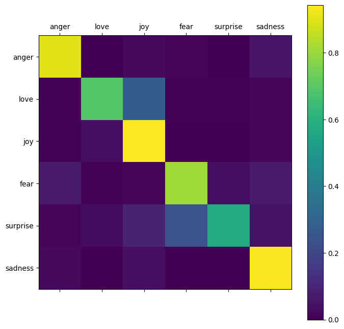

# Tweet Emotion Recognition: NLP with TensorFlow

**This notebook is my introduction to NLP with TensorFlow. I hope that through this project I can build working knowledge on NLP with TensorFlow and deepen my understanding of Neural Networks.**

In this notebook, I will explore a dataset of tweets labeled with one of six emotions: anger, fear, joy, love, sadness and surprise.

The Emotions dataset for NLP is a great resource for anyone interested in building a model for emotion recognition in tweets. It provides a large and diverse set of tweets labeled with their corresponding emotions, making it an ideal dataset for training and testing NLP models.

Throughout this notebook, I will cover the following topics:

- Data exploration
- Data Tokenization
- Data Padding and Truncating
- Model creation and Training
- Model evaluation

By the end of this notebook, you will have a solid understanding of how to use the Emotions dataset for NLP to train a model for tweet emotion recognition and how to evaluate its performance as I will try to document what I'm doing thoughout the process. Let's get started!

## Dataset

The dataset can be found at [Emotions dataset for NLP](https://www.kaggle.com/datasets/praveengovi/emotions-dataset-for-nlp)

## Getting Started

These instructions will get you a copy of the project up and running on your local machine for development and testing purposes.

### Prerequisites

- TensorFlow
- Keras
- Numpy
- Matplotlib
- Jupyter Notebook
- scikit-learn

### Get a local copy (or you can examin the [notbook](Tweet_Emotion_Recognition.ipynb) directly on github)

1. **Clone the repository:**

   `git clone https://github.com/mrdaliselmi/Tweet-Emotion-Recognition`
2. **Install the required packages:**

   `pip install -r requirements.txt`
3. **Running the model:**

   To run the Jupyter Notebook, navigate to the project directory and open the notebook named [`Tweet_Emotion_Recognition.ipynb`](Tweet_Emotion_Recognition.ipynb) and run the cells in order.

## Results

The model achieved an accuracy of 87.95 % on the validation set and 88.9 % on the test set.

Confusion matrix of the predictions vs the test set:

## Author

[Dali Selmi](https://github.com/mrdaliselmi)

## License

This project is licensed under the [MIT](LICENSE) License - see the LICENSE file for details.
